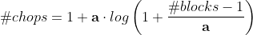
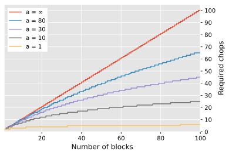

# HT's TreeChop

For a far more fun description, see https://www.curseforge.com/minecraft/mc-mods/treechop.

## Configuring chop counting (version 0.13.0 and later)
<!-- For generating equation svgs: https://www.codecogs.com/latex/eqneditor.php-->

The number of chops required to fell a tree can depend on the size of the tree (the number of log blocks it contains).

### Linear

The linear algorithm follows the function

<!--\#chops = \mathbf{chopsPerBlock} \cdot \#blocks + \mathbf{baseNumChops}-->

where the actual number of chops required is rounded according to the `chopCountRounding` configuration.

If `chopsPerBlock > 1` or `baseNumChops > 0`, then you should consider the setting for `canRequireMoreChopsThanBlocks`, which determines whether the number of chops required to fell a tree can exceed the number of blocks in the tree. For example, setting `baseNumChops = 8`, `chopsPerBlock = 0`, and `canRequireMoreChopsThanBlocks = true` would mean that all trees fall after exactly 8 chops (the number of chops needed to whittle a single log block down to nothing).

### Logarithmic
The logarithmic algorithm follows the function

<!--\#chops = 1 + \mathbf{a} \cdot log \left(1 + \frac{\#blocks - 1}{\mathbf{a}} \right)-->

where the parameter `a` controls the steepness of the curve.

The figure and tables below show how `a` affects the number of chops required for different tree sizes. The default value `a = 10` results in the gray curve. At the extremes, if `a = 0`, then any size tree will only require one chop, and if `a = ∞`, then felling a tree will require the same amount of chops as there are blocks (the red curve).   

The actual number of chops required depends on the rounding method (`chopCountRounding`), which may be `DOWN`, `NEAREST`, or `UP`.

##### Rounding: `DOWN`

| Number of blocks        |   1 |   2 |   3 |   5 |   8 |   10 |   20 |   50 |   100 |   200 |   1000 |
|:------------------------|----:|----:|----:|----:|----:|-----:|-----:|-----:|------:|------:|-------:|
| Required chops (a = 1)  |   1 |   1 |   2 |   2 |   3 |    3 |    3 |    4 |     5 |     6 |      7 |
| Required chops (a = 10) |   1 |   1 |   2 |   4 |   6 |    7 |   11 |   18 |    24 |    31 |     47 |
| Required chops (a = 30) |   1 |   1 |   2 |   4 |   7 |    8 |   15 |   30 |    44 |    61 |    107 |
| Required chops (a = 80) |   1 |   1 |   2 |   4 |   7 |    9 |   18 |   39 |    65 |   100 |    209 |
| Required chops (a = ∞)  |   1 |   2 |   3 |   5 |   8 |   10 |   20 |   50 |   100 |   200 |   1000 |

##### Rounding: `NEAREST`

| Number of blocks        |   1 |   2 |   3 |   5 |   8 |   10 |   20 |   50 |   100 |   200 |   1000 |
|:------------------------|----:|----:|----:|----:|----:|-----:|-----:|-----:|------:|------:|-------:|
| Required chops (a = 1)  |   1 |   2 |   2 |   3 |   3 |    3 |    4 |    5 |     6 |     6 |      8 |
| Required chops (a = 10) |   1 |   2 |   3 |   4 |   6 |    7 |   12 |   19 |    25 |    31 |     47 |
| Required chops (a = 30) |   1 |   2 |   3 |   5 |   7 |    9 |   16 |   30 |    45 |    62 |    107 |
| Required chops (a = 80) |   1 |   2 |   3 |   5 |   8 |   10 |   18 |   39 |    65 |   101 |    209 |
| Required chops (a = ∞)  |   1 |   2 |   3 |   5 |   8 |   10 |   20 |   50 |   100 |   200 |   1000 |

##### Rounding: `UP`

| Number of blocks        |   1 |   2 |   3 |   5 |   8 |   10 |   20 |   50 |   100 |   200 |   1000 |
|:------------------------|----:|----:|----:|----:|----:|-----:|-----:|-----:|------:|------:|-------:|
| Required chops (a = 1)  |   1 |   2 |   3 |   3 |   4 |    4 |    4 |    5 |     6 |     7 |      8 |
| Required chops (a = 10) |   1 |   2 |   3 |   5 |   7 |    8 |   12 |   19 |    25 |    32 |     48 |
| Required chops (a = 30) |   1 |   2 |   3 |   5 |   8 |    9 |   16 |   31 |    45 |    62 |    108 |
| Required chops (a = 80) |   1 |   2 |   3 |   5 |   8 |   10 |   19 |   40 |    66 |   101 |    210 |
| Required chops (a = ∞)  |   1 |   2 |   3 |   5 |   8 |   10 |   20 |   50 |   100 |   200 |   1000 |
