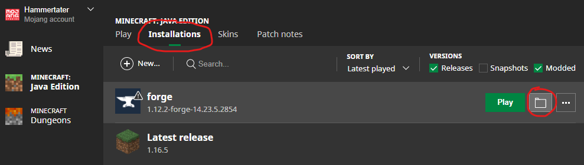
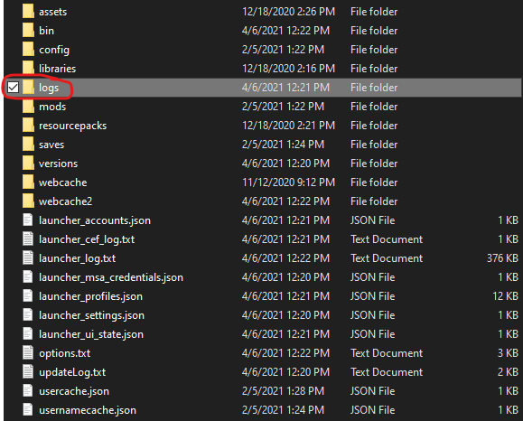
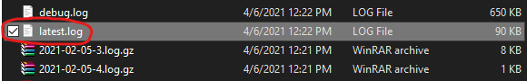
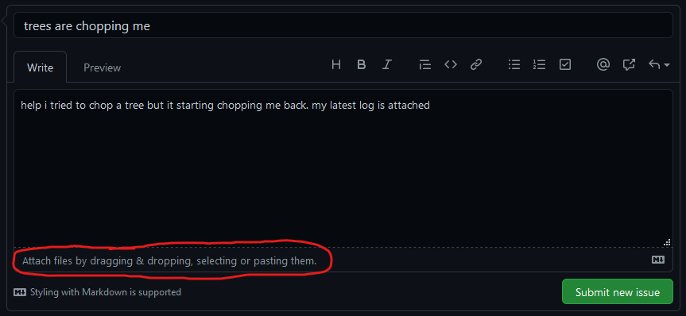

# How to find and share Minecraft logs

*As of April 6, 2021*

The Minecraft game folder can be found through Mojang's launcher by 1) clicking the "Installation" tab at the top, then 2) clicking the folder icon to the right of any game version:
 

Most game logs are stored inside the `logs` folder:

Find the `latest.log` file:

and share that file with your favorite mod developer:
 1. Go to https://github.com/hammertater/treechop/issues/new,
 1. Describe the issue you're having and give it a title
 1. Attach your `latest.log` file
 4. Click "Submit new issue"
 

 Note that this will require a GitHub account, but that's okay! They're free and easy to make.
 